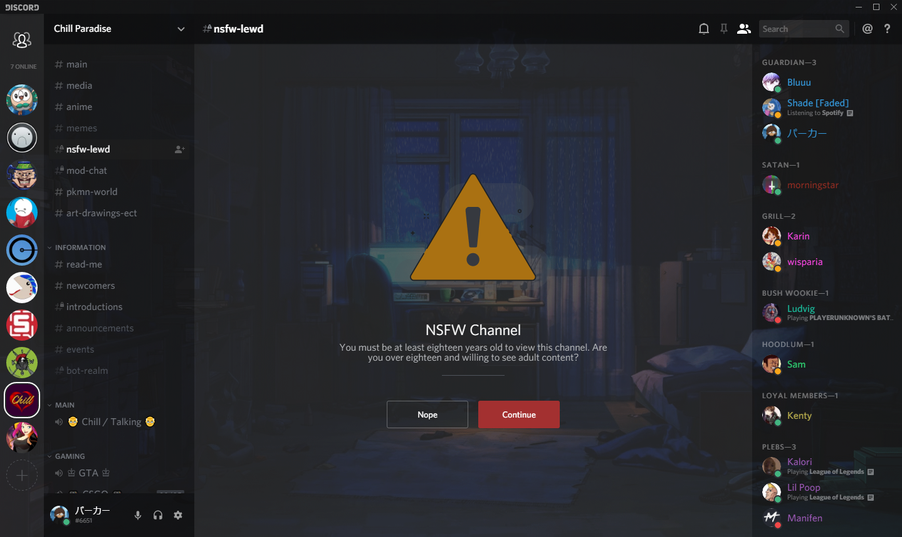

# Zaigenshi's Transient Material Fork

- Fixes several issues with the original [TransientMaterial](https://github.com/rauenzi/BetterDiscordAddons/tree/master/Themes/TransientMaterial) theme and adds a few customizations for yours truly.

## Pictures

## Instructions

- First install [node.js](https://nodejs.org/en/) current before installing [BandagedBD](https://github.com/rauenzi/BetterDiscordApp/releases) from the releases page and restart.

- Next go to themes in your discord settings and click "open theme folder"

- Drag TransientMaterial.theme.css from the TransientMaterial folder to your themes folder.

- Press Ctrl+R in discord to restart and go back to user settings to toggle the theme.

- Profit??

## Note

- Background can be changed by editing the url in TransientMaterial.theme.css
